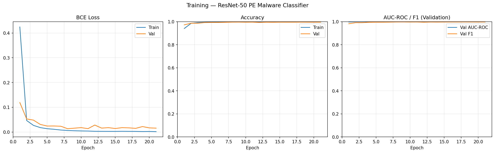
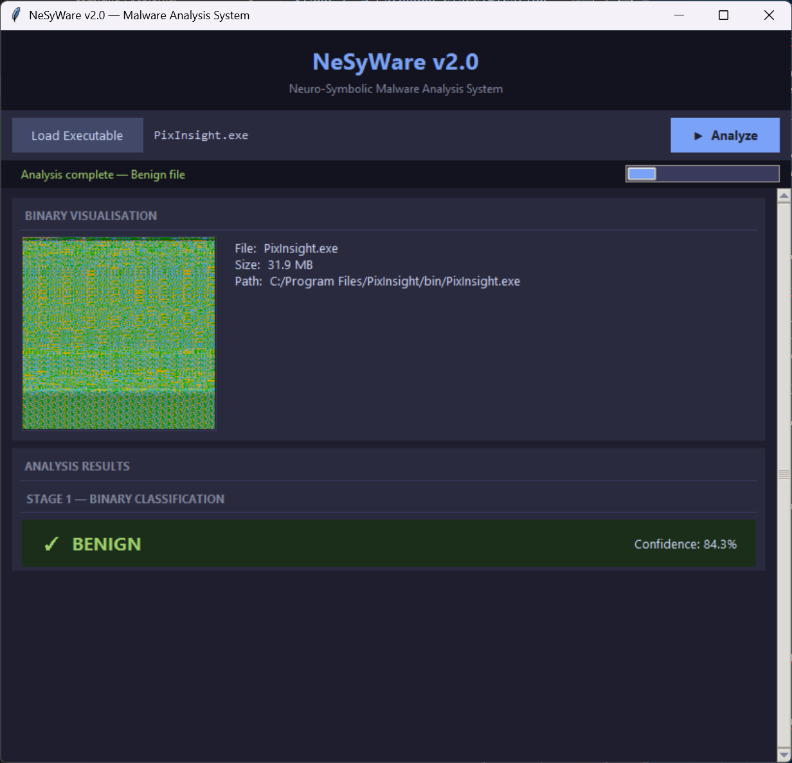
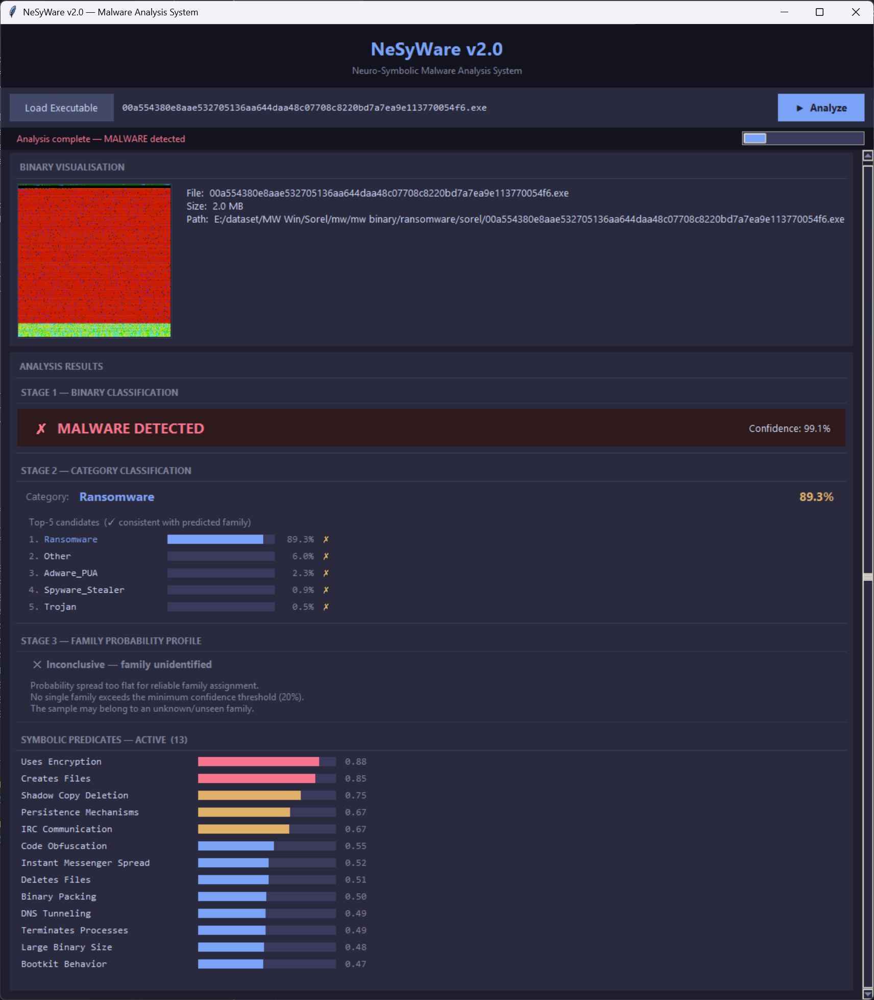
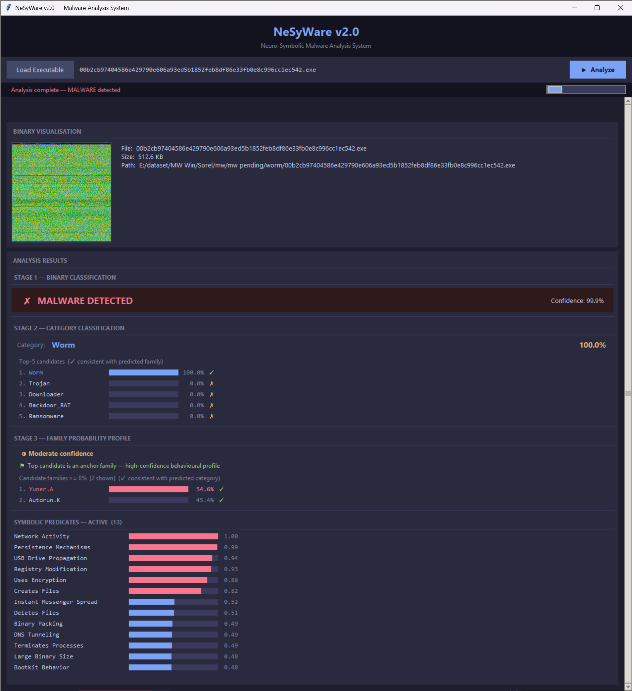
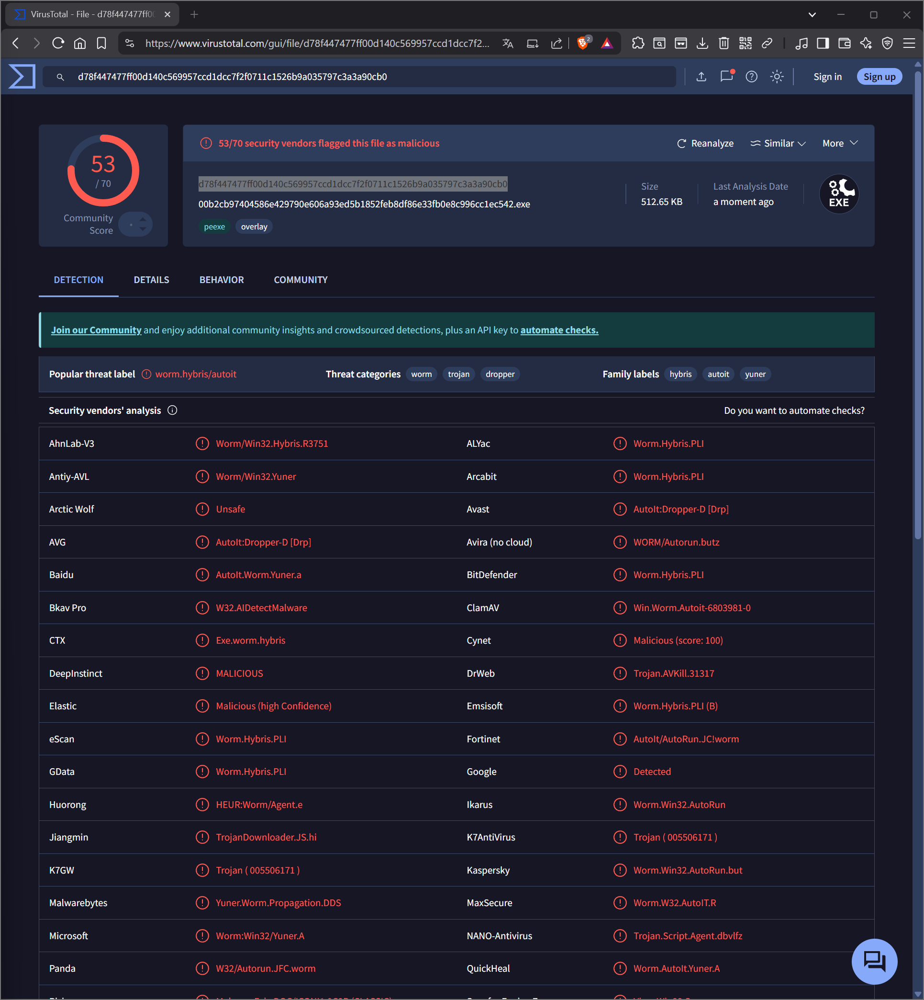
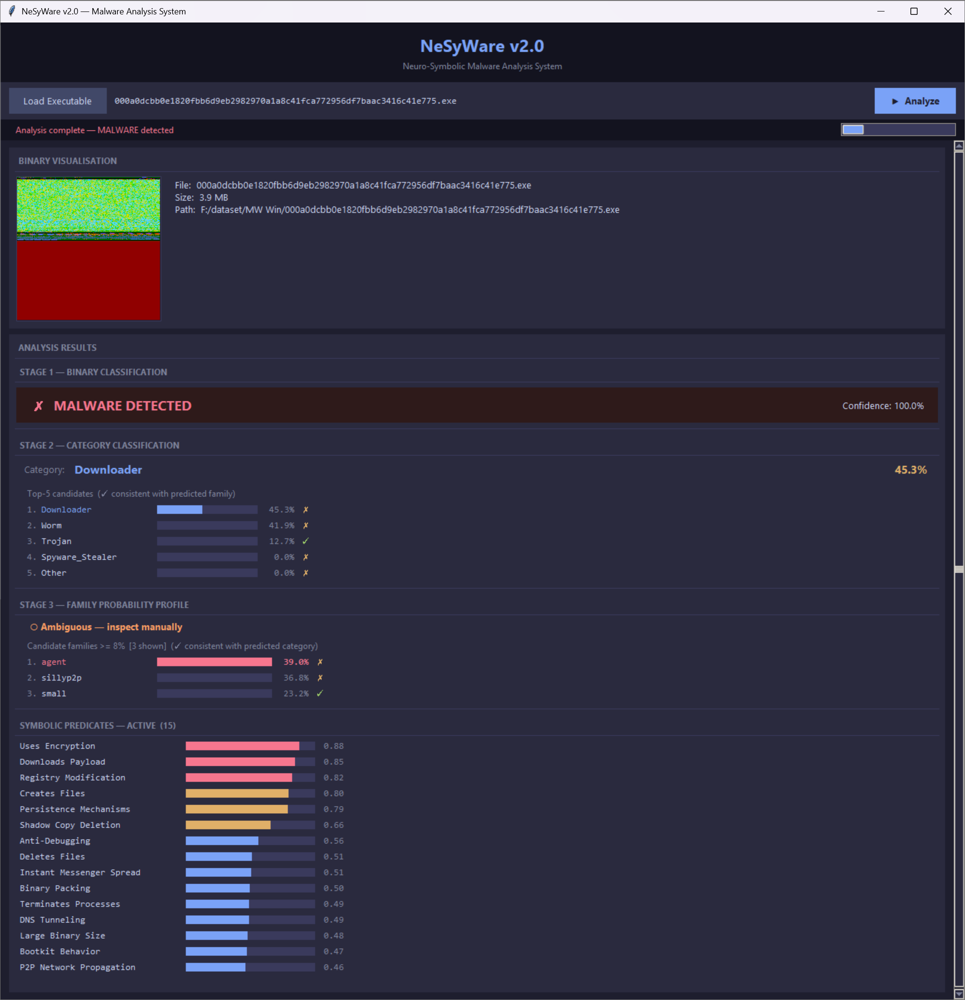
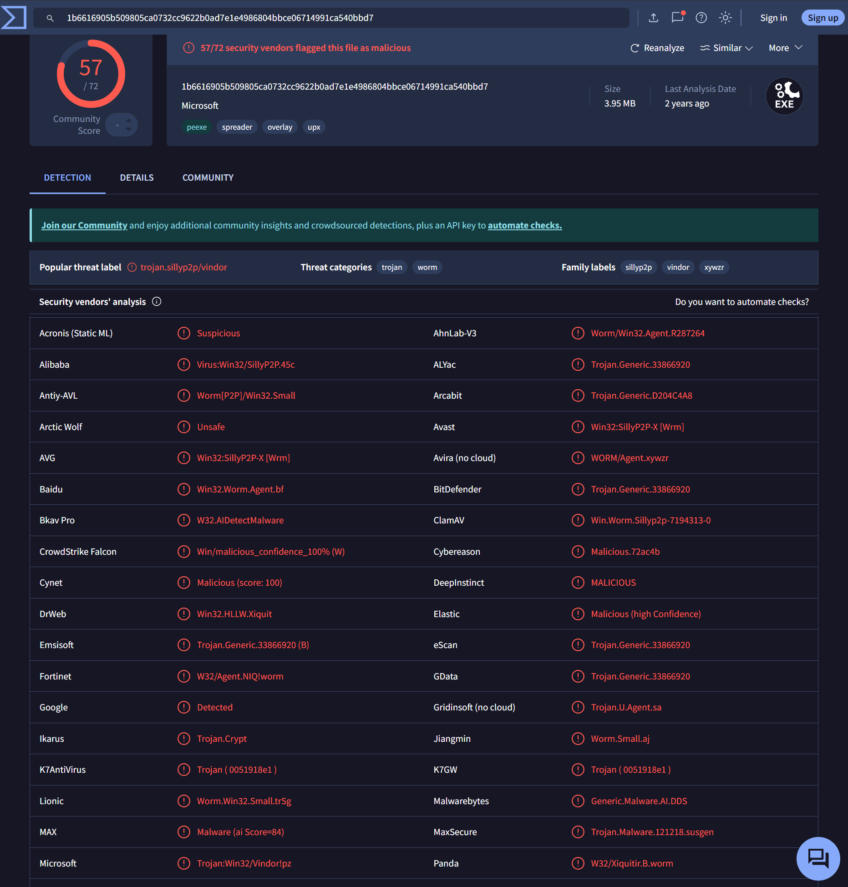

# NeSyWare v2.1 - Modular Framework (Beta Release)

A three-stage hierarchical implementation of the NeSyWare framework for static analysis of Windows PE executables.
Combines a ResNet-50 with a Logic Tensor Network (LTN) knowledge base to produce
interpretable, confidence-ranked classification results.

---

## Architecture

```
PE file
  │
  ▼
[PE → RGB image]          pe_to_image.py
  R = raw byte values
  G = Shannon entropy (local, 256-byte windows)
  B = printable character mask (0x20–0x7E)
  │
  ▼
Stage 1 - Binary CNN      ResNet-50 (fine-tuned)
  benign vs. malware
  │
  ├─ malware → Stage 2/3 → full report
  │
  └─ benign → Stage 2/3 lightweight check
               ├─ family conf < 30% → BENIGN confirmed
               └─ family conf ≥ 30% → SUSPICIOUS
                  (Stage 2/3 details shown, manual review required)
  │
  ▼
Stage 2 - Category CNN    ResNet-50 + LTN
  10 macro-categories      Trojan / Worm / Downloader / Backdoor_RAT /
                           Ransomware / Adware_PUA / Spyware_Stealer /
                           Virus / Botnet / Other
  │
  ▼
Stage 3 - Family + KB     117 families  |  54 symbolic predicates
  combined score =         0.65 × neural + 0.35 × KB
```

---

## Stage 1 Results



| Metric | Value |
|--------|-------|
| Accuracy | **99.67%** |
| AUC-ROC | **99.96%** |
| F1 | **99.79%** |
| False positives | 0.47% |
| False negatives | 0.29% |

---

## Stage 2/3 Results

*In the paper*

---

## Data Sources

### Stage 1

Training data for the binary classifier draws from multiple publicly available
malware datasets combined with benign PE files collected from a clean
QEMU Windows 11 virtual machine (zero VirusTotal detections).

| Source | Role |
|--------|------|
| SOREL | Malware (auxiliary supervision) |
| MalImg | Malware |
| MaleVis | Malware |
| BODMAS | Malware |
| Clean VM | Benign |

### Stage 2/3

117 malware families across 10 categories. Full family list available in [`families.md`](./families.md).


### Note on checkpoint selection

The selected Stage 2/3 checkpoint uses weights from the SOREL-augmented run.
Although a non-SOREL variant achieves marginally higher F1 scores on the
held-out test set, the SOREL run was preferred for its symbolic expressiveness:
the LTN grounds an average of **40 active predicates** per sample, compared to
**35** without SOREL auxiliary supervision. A richer predicate activation profile
produces more informative symbolic explanations, which is a core design goal of
the framework - interpretability is treated as a first-class objective alongside
raw classification accuracy.

### Quartile F1 distribution

| Quartile | F1 Range | Families | Share |
|----------|----------|----------|-------|
| Q4 | ≥ 0.75 | 93 | 79.5% |
| Q3 | 0.50 – 0.75 | 13 | 11.1% |
| Q1–Q2 | < 0.50 | 11 | 9.4% |
| **Total** | | **117** | **100%** |

---

## Requirements

- Python 3.10+
- PyTorch ≥ 2.0 with CUDA (CPU inference supported but slow)
- torchvision ≥ 0.15
- Pillow ≥ 10.0
- NumPy ≥ 1.24

```bash
pip install -r requirements.txt
```

The weights file (`weights/nesyware_v2.pth`) must be present before running.

| File | Description | Download |
|------|-------------|----------|
| `weights/stage1_binary.pth` | Stage 1 binary classifier (~95 MB) | [HuggingFace](https://huggingface.co/lostCosmonaut/NeSyWare/tree/main/weights_v2) |
| `weights/stage23_nesyware.pth` | Stage 2/3 NeSyWare checkpoint (~666 MB) | [HuggingFace](https://huggingface.co/lostCosmonaut/NeSyWare/tree/main/weights_v2) |
---

## Launch

```bash
cd "NeSyWare tool v2-beta"
python app.py
```

Models load in the background on startup (~5–10 s). Once the status bar shows
**System ready**, load a PE file and click **▶ Analyze**.

---

## GUI Walkthrough

### Loading a file

Click **Load Executable** to open the file dialog. Accepted extensions: `.exe`, `.dll`, `.sys`, `.scr`, `.com`.  
A preview of the RGB binary visualisation used as CNN input is rendered in the left panel.

### Results panel

**Stage 1 - Binary Classification**

| Verdict | Condition |
|---------|-----------|
| `BENIGN` | Stage 1 benign + Stage 2/3 family confidence < 30% |
| `SUSPICIOUS` | Stage 1 benign + Stage 2/3 family confidence ≥ 30% - manual review required |
| `MALWARE` | Stage 1 malware - full Stage 2/3 report shown |
| `UNCERTAIN` | Stage 1 confidence < 50% - Stage 2/3 shown for reference only |

Confidence levels: `High` ≥ 70% · `Medium` ≥ 50% · `Uncertain` < 50%


*Benign Sample Detection* \*

**Stage 2 - Category Classification**

Predicted macro-category with confidence and top-5 category distribution.
A ✓ marker indicates consistency with the predicted family.

**Stage 3 - Family Probability Profile**

Families with combined score ≥ 8% are listed with confidence bars.
- `High-confidence` ≥ 70% · `Moderate` ≥ 50% · `Ambiguous` ≥ 20% · `Inconclusive` < 20%
- ✓ marks families consistent with the predicted category
- ⚑ marks anchor families - strong, well-separated behavioural profiles in the knowledge base


*Malware samples w/o family, it is associated with the closest one or flagged for manual inspection* \*

**Symbolic Predicates**

Up to 54 behavioural attributes grounded by the LTN, shown for activations ≥ 0.40.  
Colour-coded by strength: red ≥ 0.80 · yellow ≥ 0.60 · blue < 0.60.


*Malware Analysis* \*


*VT behavior confirmation* \*


*Malware Analysis with percentage of malware family membership* \*


*VT behavior confirmation* \*


\* : external samples; they have not been used during training.

---

## Files

| File | Description |
|------|-------------|
| `app.py` | Tkinter GUI - main entry point |
| `inference.py` | Self-contained inference engine |
| `pe_to_image.py` | PE → RGB image converter |
| `requirements.txt` | Python dependencies |
| `weights/stage1_binary.pth` | Stage 1 ResNet-50 binary classifier (~95 MB) |
| `weights/stage23_nesyware.pth` | Stage 2/3 NeSyWare checkpoint (~666 MB) |
| `families.md` | Full list of supported families and categories |

---

## Evaluation

A complementary evaluation was conducted to assess the robustness of the pipeline:


### External validation (OOD)

14,820 SOREL malware samples never seen during training were used to evaluate
out-of-distribution generalisation. This set represents a realistic deployment scenario
where the model encounters families and variants it has not been trained on.

| Metric | Value |
|--------|-------|
| Accuracy | **89.6%** |

| Difficulty | Categories |
|------------|-----------|
| Most challenging | Unknown, File Infector, Worm |
| Least challenging | Flooder, Installer, Packed |

### Code injection evasion
Internal and External validation sets were subjected to PE-level code injection techniques
(overlay append, new section injection, slack space filling) to evaluate robustness
against simple evasion attempts. Results are reported per injection type and per folder.

### Internal folder

| Strategy | Evasion Rate |
|----------|-------------|
| Overlay append 5% | 0.43% |
| Overlay append 15% | 0.73% |
| New section 5% | 0.49% |
| New section 10% | 0.74% |
| Slack space filling | 0.47% |

### External folder (OOD)

| Strategy | Evasion Rate |
|----------|-------------|
| Overlay append 5% | 17.87% |
| Overlay append 10% | 28.52% |
| New section 5% | 16.46% |
| Slack space filling | 4.79% |
---

## Limitations

- **Static analysis only** - packed, encrypted, or obfuscated binaries that differ
  visually from their training representatives may be misclassified.
- **Visual features only** - the 54 symbolic predicates are grounded from visual
  features, not dynamic execution traces; they reflect visual correlates of behaviour,
  not verified runtime actions.
- **Nearest-neighbour fallback** - when a sample is recognised as malware but does not
  match any known family with sufficient confidence, the framework assigns the closest
  family and category according to the learned weight space. This is a best-effort
  approximation, not a definitive classification, and should be treated as such.
- **Label noise is inherent** - antivirus vendors on VirusTotal frequently disagree on
  family and category labels for the same sample. The framework is trained on
  given datasets labels, which mitigate but do not eliminate this ambiguity.
  Low F1 scores on families such as `wacatac`, `ditertag`, or `Autorun.K` reflect
  heterogeneous detection methodologies rather than framework failure.
- **The `SUSPICIOUS` verdict requires manual review** — it indicates a conflict between
  Stage 1 and Stage 2/3 rather than a definitive classification.
- **Out-of-distribution samples** will produce `Inconclusive` or `Ambiguous` family
  profiles. The false negative rate on OOD samples is consistent with known
  behaviour of CNN-based malware visualisation approaches.

---

## Future Improvements

- **Stronger Stage 1 discrimination** - expanding the binary classifier training set
  with a larger and more diverse collection of both malware samples and benign PE files,
  to improve robustness across a wider range of real-world inputs.
- **Improved PE voting system** - replacing or augmenting the current single-pass
  classification with an ensemble or multi-crop voting strategy to reduce sensitivity
  to individual binary layout variations.
- **Beyond visual features** - investigating complementary feature representations
  (e.g., static imports, section entropy profiles, header metadata) to reduce reliance
  on visual similarity alone and improve generalisation to packed or obfuscated samples.
- **Addressing label ambiguity** - developing strategies to handle families where AV
  vendor disagreement is structurally high, rather than treating them as standard
  classification targets.
- **Ablation on Entropy** - integrate in the system an entropy discriminator for newer malware samples.


> ⚠️ **Disclaimer** - NeSyWare is an AI-based research framework and may produce
> incorrect classifications. It is intended to assist - NOT replace - professional
> malware analysis workflows. Results should always be cross-validated with
> VirusTotal, sandbox environments, and dedicated static/dynamic analysis tools.
